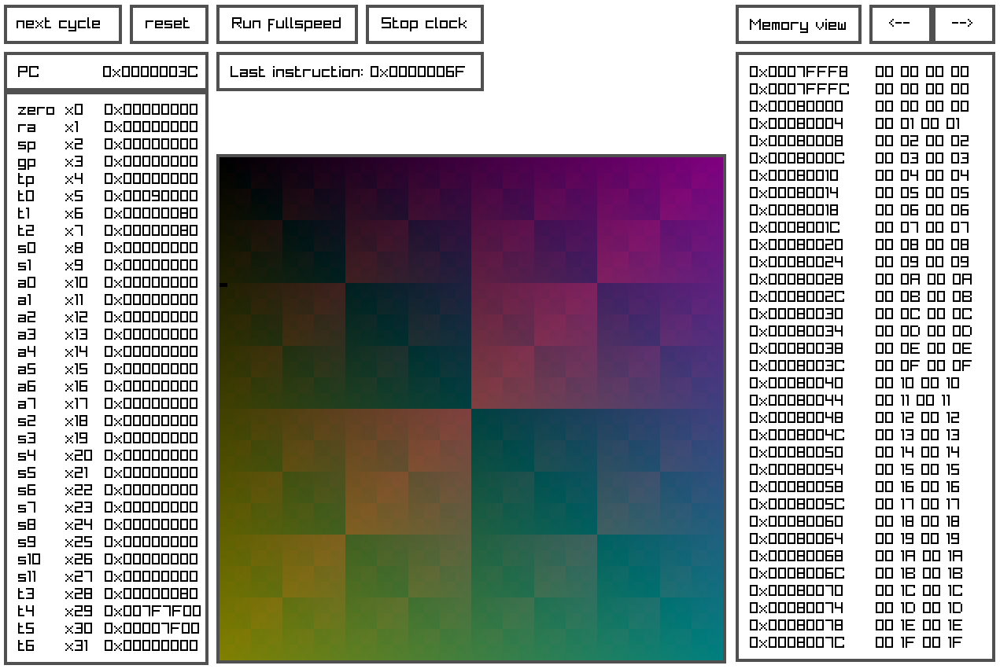

# Welcome to DreamRV!

DreamRV (from dream RISC-V) is a virtual platform to test and run simple programs created in RISC-V assembly. Similar to the PICO-8, but very low level: perfect for learning assembly and how computers work!


 ## Features
* **Simple MMIO RGBA framebuffer and buttons:** forget about interrupts! all you need to do is read some memory addresses to display pixels to the screen, or get gamepad inputs

* **Debugging info:** not quite able to squish that bug? DreamRV offers a debug mode, where you can go cycle by cycle, watching how registers and memory values change

## Usage
``` ./DreamRV programName.bin [-c clockFrequency] [-m memoryAddress] [-s] [-f]```
* **clockFrequency**: what the CPU simulation will run at when unlocked (positive integer)
* **memoryAddress**: on debug mode, the default memory page to show (positive integer, can be hex using 0x...)
* **-s**: screen only mode, without the CPU info.
* **-f**: force, jump directly to the simulation loop without loading the program binary

## Images


